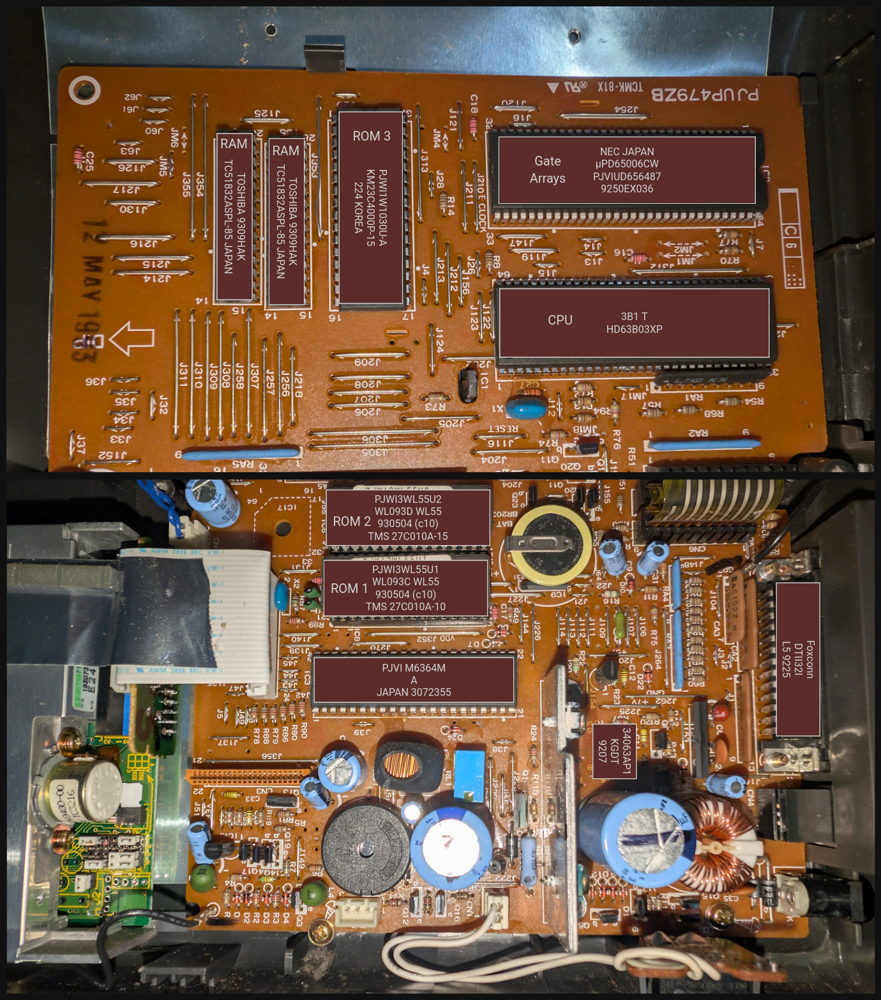

# Components

## CPU - HD63B03XP

[datasheet](https://rocelec.widen.net/view/pdf/bz4q6bm06r/RNCCS10700-1.pdf)

- Compatible with HD6301V1
- 192 bytes of RAM

## ROM 1 + 2 - TMS 27C010A-10/15

[datasheet](https://www.alldatasheet.com/datasheet-pdf/download/87796/TI/TMS27C010A.html)

- ROM 1 is `-10` meaning 100ns access time
- ROM 2 is `-15` meaning 100ns access time
- Each is 131,072 by 8 bits, meaning 1,048,576 bits

## ROM 3 - KM23C4000P-15

[similar MX23C4000 datasheet](https://datasheet4u.com/download/80205/23C4000.html)
[similar KM23C4000D datasheet](https://www.digchip.com/datasheets/parts/datasheet/409/KM23C4000D-pdf.php)

## Gate Arrays - μPD65000CW

[general μPD65000 datasheet](https://www.alldatasheet.com/datasheet-pdf/download/115557/NEC/UPD65000.html)

## RAM

[datasheet](https://www.alldatasheet.com/datasheet-pdf/download/1462411/TOSHIBA/TC51832ASPL-85.html)

- 256K each pseudo-static RAM

# Address state on boot

- JM1 is not fitted, so VECT is low, so C000-FFFF is IC6.
- Apparently page 0x1C000 of IC6 is loaded in to C000 of the memory map
- Sensible vector table appears at FFEA, with reset vector at D296
- Apparently sensible reset code at 1D296 in this chip, so D296 in memory map

# Pins

## BA - Bus Available

- Normally low
- Goes high when CPU accepts $\overline{\text{HALT}}$ and releases the buses

## Ports

| Port   | Address | Data Direction Register |
|--------|---------|-------------------------|
| Port 2 | $0003   | $0001, 2 bits           |
| Port 5 | $0015   | -                       |
| Port 6 | $0017   | $0016                   |

### Port 2

- 8-bit I/O port
- DDR made up of 2 bits
    - Bit 0 decides the I/O direction of $P_{20}$
    - Bit 1 decides the I/O direction of $P_{21}$ to $P_{27}$
    - 0 for input and 1 for output
- Port 2 is also used as an I/O pin for the timers and SCI
    - When used like this, port 2 except $P_{20}$ becomes an input or output
        automatically depending on their function regardless of the DDR

### Port 5

- 8-bit input only port
- Data direction register ($0016)
    - 0: $\overline{\text{IRQ}_1}$ Enable Bit
    - 1: $\overline{\text{IRQ}_2}$ Enable Bit
    - 2: MRE - Memory Ready Enable Bit
    - 3: HLTE - $\overline{\text{HALT}}$ Enable Bit
    - 4: unused
    - 5: unused
    - 6: RAME - RAM Enable
    - 7: STBY PWR - Standby Power Bit

# Computation Model

- Program is started from $FFFE-F
- Double accumulator D is made up of byte accumulators A and B
- X: index register
- SP: stack pointer
- PC: program counter
- CCR: condition code register
    - 0 C: Carry / borrow from MSB
    - 1 V: Overflow, 2's complement
    - 2 Z: Zero ()
    - 3 N: Negative (sign bit)
    - 4 I: Interrupt mask
    - 5 H: Half carry from bit 3 to bit 4
    - 6, 7: Unused

# Links

- [a bored programmer's blog on the KX-WL55 and the printer](https://aboredprogrammer.com/panasonic-wl55-kx-wl55/)
- [KX-WL55 manual](https://aboredprogrammer.com/wp-content/uploads/2017/02/84e3d34c3587fbafc73c919987b91b25.pdf)
- [KX-W1000 service manual](https://archive.org/details/kx-w1000-service-manual/KX-W1000%20Service%20Manual_600dpi/page/n1/mode/2up)
- [KX-W1500 service manual](https://www.manualslib.com/manual/3353446/Panasonic-Kx-W1500.html)
- [panasonic_typewriter_interface](https://github.com/xunker/panasonic_typewriter_interface)

